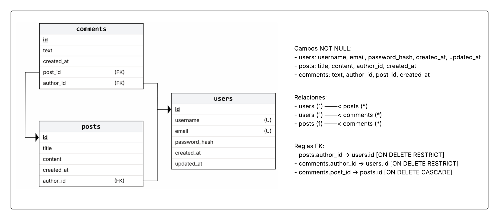

<h1 align="center">📝 Mini Blog API</h1>

<p align="center">
  <b>API REST asíncrona</b> desarrollada con 
  <b>FastAPI</b>, <b>SQLAlchemy 2.0 (Async)</b>, <b>PostgreSQL</b>, <b>Alembic</b>, <b>Pytest</b> y <b>Poetry</b>.<br>
  Diseñada para la <b>Prueba Técnica de Sintad S.A.C.</b> con foco en calidad, pruebas, migraciones y despliegue vía Docker.
</p>

<p align="center">
  
  
  
  
  
  
</p>


## 📚 Índice

| Fase | Descripción |
|------|--------------|
| 🧩 [Fase 1 – Diseño y Modelado de la Base de Datos](#-fase-1--diseño-y-modelado-de-la-base-de-datos) |
| 🌸 [Fase 2 – Configuración y Desarrollo del Backend](#-fase-2--configuración-y-desarrollo-del-backend) |
| 🧪 [Fase 3 – Calidad de Código y Pruebas](#-fase-3--calidad-de-código-y-pruebas) |
| 🐳 [Fase 4 – Documentación y Despliegue](#-fase-4--documentación-y-despliegue) |
| 🤖 [Fase 5 – Prompt para Asistente de IA](#-fase-5--prompt-para-asistente-de-ia) |
| 📜 [Autoría](#-autoría) |


## 🧩 Fase 1 – Diseño y Modelado de la Base de Datos

### 🧠 Descripción general

Base de datos en **PostgreSQL (3NF)** con integridad referencial estricta:  
`users`, `posts`, `comments`.

### 🗺️ Diagrama Entidad–Relación



---

### ⚙️ Elección de la Base de Datos

- ACID y robustez en producción  
- Soporte para tipos avanzados y extensiones  
- Integración nativa con SQLAlchemy Async y Alembic  

---

### 🧾 Estructura de Tablas

#### 🧍 `users`

| Campo | Tipo | Restricciones |
|--------|------|----------------|
| id | BIGSERIAL | PK |
| username | VARCHAR(30) | UNIQUE, NOT NULL |
| email | VARCHAR(254) | UNIQUE, NOT NULL |
| password_hash | TEXT | NOT NULL |
| created_at | TIMESTAMPTZ | DEFAULT now() |
| updated_at | TIMESTAMPTZ | DEFAULT now() |

#### 📝 `posts`

| Campo | Tipo | Restricciones |
|--------|------|----------------|
| id | BIGSERIAL | PK |
| title | VARCHAR(200) | NOT NULL |
| content | TEXT | NOT NULL |
| created_at | TIMESTAMPTZ | DEFAULT now() |
| author_id | BIGINT | FK → users.id (ON DELETE RESTRICT) |

#### 💬 `comments`

| Campo | Tipo | Restricciones |
|--------|------|----------------|
| id | BIGSERIAL | PK |
| text | TEXT | NOT NULL |
| created_at | TIMESTAMPTZ | DEFAULT now() |
| post_id | BIGINT | FK → posts.id (ON DELETE CASCADE) |
| author_id | BIGINT | FK → users.id (ON DELETE RESTRICT) |

---

### 🔗 Relaciones Clave

| Entidad origen | Relación | Entidad destino | Cardinalidad |
|----------------|-----------|----------------|---------------|
| `users` | → | `posts` | 1 ───▶ * |
| `users` | → | `comments` | 1 ───▶ * |
| `posts` | → | `comments` | 1 ───▶ * |

---

### ⚡ Campos NOT NULL

| Tabla | Campos obligatorios |
|--------|----------------------|
| **users** | username, email, password_hash, created_at, updated_at |
| **posts** | title, content, author_id, created_at |
| **comments** | text, author_id, post_id, created_at |

---

### 📊 Índices sugeridos

- `posts (author_id)`  
- `posts (created_at DESC)`  
- `comments (post_id)`  
- `comments (author_id)`  
- `comments (created_at DESC)`

---

## 🌸 Fase 2 – Configuración y Desarrollo del Backend

### 🧠 Descripción general

Stack moderno **asincrónico** basado en **FastAPI** y **SQLAlchemy Async**, con arquitectura modular y separación clara por capas.

---

### ⚙️ Tecnologías principales

| Tecnología | Descripción |
|-------------|-------------|
| **Python 3.10** | Lenguaje base del proyecto |
| **FastAPI** | Framework principal para la API REST |
| **SQLAlchemy 2.0 (Async)** | ORM asincrónico para PostgreSQL |
| **Pydantic v2** | Validación y tipado de modelos |
| **Alembic** | Migraciones automáticas de base de datos |
| **Poetry** | Gestión de dependencias y entorno virtual |
| **Uvicorn** | Servidor ASGI para ejecución asincrónica |

---

### 🗂️ Estructura del Proyecto

```plaintext
mini_blog_api/
├── Dockerfile
├── docker-compose.yml
├── alembic.ini
├── migrations/
│   ├── env.py
│   └── versions/
│       └── <timestamp>_init_schema.py
├── envs/
│   ├── .env.example
│   └── .env.docker.example
├── src/mini_blog_api/
│   ├── main.py
│   ├── core/
│   │   ├── settings.py
│   │   └── database.py
│   ├── models/
│   │   └── models.py
│   ├── schemas/
│   │   ├── users.py
│   │   ├── posts.py
│   │   └── comments.py
│   ├── services/            # ← capa de negocio
│   │   ├── users.py
│   │   ├── posts.py
│   │   └── comments.py
│   └── routers/
│       ├── users.py
│       ├── posts.py
│       └── comments.py
└── tests/
    ├── conftest.py
    ├── test_users.py
    ├── test_posts.py
    └── test_comments.py
```

### 🔌 Endpoints Implementados

#### 👤 Usuarios

| Método | Ruta | Descripción |
|--------|------|--------------|
| **POST** | `/users/` | Crear usuario |
| **GET** | `/users/{user_id}` | Obtener usuario |

#### 📝 Publicaciones

| Método | Ruta | Descripción |
|--------|------|--------------|
| **POST** | `/posts/` | Crear post |
| **GET** | `/posts/` | Listar posts |
| **GET** | `/posts/{post_id}` | Obtener post (incluye comentarios) |

#### 💬 Comentarios

| Método | Ruta | Descripción |
|--------|------|--------------|
| **POST** | `/posts/{post_id}/comments/` | Agregar comentario |
| **GET** | `/posts/{post_id}/comments/` | Listar comentarios |

---

### ⚙️ Variables de Entorno (Local)

```bash
# Copiar archivo de ejemplo
cp envs/.env.example .env

```
### ⚙️ Ajustar archivo .env (modo desarrollo con Poetry)
```bash
# Entorno de ejecución
APP_ENV=dev

# Base de datos principal (asyncpg)
DATABASE_URL=postgresql+asyncpg://postgres:<TU_PASSWORD>@localhost:5432/mini_blog

# Base de datos de pruebas
TEST_DATABASE_URL=postgresql+asyncpg://postgres:<TU_PASSWORD>@localhost:5432/mini_blog_test

# Crear tablas en startup (solo dev). En tests poner 0.
RUN_STARTUP_DDL=1
```

## 🧪 Fase 3 – Calidad de Código y Pruebas

### 🧠 Descripción General

Pruebas de integración con **pytest** sobre una base de datos de prueba separada.  
Las migraciones se gestionan con **Alembic**, garantizando consistencia de esquema entre entornos.

---

### 🧰 Herramientas Utilizadas

| Herramienta | Descripción |
|--------------|-------------|
| **pytest** | Framework principal de testing |
| **pytest-asyncio** | Soporte para pruebas asíncronas |
| **httpx (AsyncClient)** | Cliente HTTP asíncrono para peticiones a la API |
| **AnyIO** | Compatibilidad universal de asincronía |
| **Alembic** | Gestión de migraciones de base de datos |
| **PostgreSQL** | Motor de base de datos |
| **NullPool (Windows)** | Prevención de errores de conexión persistente en entornos Windows |

---

### 🧪 Estructura de Pruebas

```plaintext
tests/
├── conftest.py        # Configura engine, sesión y cliente HTTP. Limpieza entre tests.
├── test_users.py      # Pruebas: POST /users, GET /users/{id}
├── test_posts.py      # Pruebas: POST /posts, GET /posts/
└── test_comments.py   # Pruebas: POST /posts/{id}/comments, GET /posts/{id}/comments
```

### ⚙️ Configuración de Pytest

```ini
# Archivo: pytest.ini
[pytest]
asyncio_mode = auto
testpaths = tests
python_files = test_*.py
filterwarnings = ignore::DeprecationWarning
```

### ▶️ Migraciones

```bash
# Generar nueva revisión
alembic revision --autogenerate -m "init schema"

# Aplicar migraciones
alembic upgrade head

# migrations/env.py
compare_type = True  # Detecta cambios de tipo en columnas

```

### 🏃 Ejecutar Tests

```bash
poetry run pytest -v
```

```plaintext
==================== test session starts ====================
collected 5 items

tests/test_users.py .....                                  [ 40%]
tests/test_posts.py .....                                  [ 80%]
tests/test_comments.py .....                               [100%]

===================== 5 passed in 2.31s =====================

```

## 🐳 Fase 4 – Documentación y Despliegue

### ▶️ Ejecutar con Poetry (Local)

```bash
# Copiar archivo de entorno
cp envs/.env.example .env

# Instalar dependencias
poetry install

# Aplicar migraciones
alembic upgrade head

# Iniciar servidor local
poetry run uvicorn mini_blog_api.main:app --app-dir src --reload

```

**Documentación:**  
👉 [http://127.0.0.1:8000/docs](http://127.0.0.1:8000/docs)

---

### ▶️ Ejecutar con Docker Compose

```bash
# Copiar entorno para Docker
cp envs/.env.docker.example .env.docker

# Construir e iniciar contenedores
docker compose up -d --build

# Ver logs de la API
docker compose logs -f api

```
**API disponible en:**  
👉 [http://localhost:8000](http://localhost:8000)

---

### 🧪 cURL de Ejemplo (Windows PowerShell)

```powershell
# Crear usuario
curl -s -X POST http://localhost:8000/users/ `
  -H "Content-Type: application/json" `
  -d "{\"username\":\"carl\",\"email\":\"carl@example.com\",\"password\":\"secret123\"}"

# Crear post
curl -s -X POST http://localhost:8000/posts/ `
  -H "Content-Type: application/json" `
  -d "{\"title\":\"Hola\",\"content\":\"Mundo\",\"author_id\":1}"

# Listar posts
curl -s http://localhost:8000/posts/?limit=5

# Obtener post por ID
curl -s http://localhost:8000/posts/1

# Agregar comentario
curl -s -X POST http://localhost:8000/posts/1/comments/ `
  -H "Content-Type: application/json" `
  -d "{\"text\":\"Buen post!\",\"author_id\":1}"

# Listar comentarios de un post
curl -s http://localhost:8000/posts/1/comments/
```

## 🤖 Fase 5 – Prompt para Asistente de IA

Guarda este archivo en:  
`.github/copilot-instructions.md` *(ya incluido en el repositorio)*

---

### 🧩 Mini Blog API — Instrucciones para Agentes de IA (Meta-prompt)

Actúa como un **desarrollador backend senior** experto en **Python**, **FastAPI**, **SQLAlchemy Async** y **Pydantic v2**.  
Prioriza calidad, legibilidad, tipado y pruebas. Explica decisiones breves cuando aporten claridad.

---

### 1️⃣ Contexto del Proyecto

- **Stack:** Python 3.10, FastAPI (APIRouter + lifespan), SQLAlchemy 2.0 async, Pydantic v2, Alembic, pytest (async), Poetry.  
- **Estructura:** `src/mini_blog_api/` con `core/`, `models/`, `schemas/`, `services/`, `routers/` y `main.py` como entrypoint.  
- **Ciclo de vida:** `main.py` usa `lifespan`. La variable `RUN_STARTUP_DDL` controla la creación automática de tablas (usar `0` en tests).

---

### 2️⃣ Principios y Reglas Obligatorias

- **SOLID / DRY / KISS:** funciones cortas y cohesionadas; mover la lógica de negocio a `services/`.  
- **Tipado exhaustivo** y **docstrings concisos**.  
- No exponer credenciales ni `password_hash` en responses o logs.  
- Códigos HTTP estándar:  
  - `201` → creación  
  - `200` → OK  
  - `404` → not found  
  - `409` → conflict  
  - `400` → validación  

---

### 3️⃣ Convenciones FastAPI / Base de Datos

- **Routers:** usar `APIRouter(prefix, tags)` + `response_model`.  
- **Sesión:** con `Depends(get_session)` (`AsyncSession`).  
- Evitar N+1 usando `selectinload` al serializar relaciones.  
- **Transacciones:**  
  `add()` → `commit()` → `refresh()` o recargar con `select` + `selectinload`.  
- Manejo de errores:  
  `IntegrityError` → `rollback()` → `HTTPException(409, ...)`.

---

### 4️⃣ Migraciones y Despliegue

```bash
# Generar revisión
alembic revision --autogenerate -m "..."

# Aplicar migraciones
alembic upgrade head
```

```python
# migrations/env.py
compare_type = True  # Detecta cambios de tipo en columnas
```

### 5️⃣ Pruebas

```bash
# Ejecutar pruebas
poetry run pytest -v
```
**Fixtures** en `tests/conftest.py`:  
`engine (NullPool)`, `session_factory` y cliente HTTP (`ASGITransport`); override de `get_session`.

**Limpieza por test:**  
`TRUNCATE ... RESTART IDENTITY CASCADE`

---

### 6️⃣ Patrones Concretos

- **Crear usuario:** usar `bcrypt` (72 chars máx.), devolver **409** si ya existe.  
- **Crear post:** validar autor (**404** si no existe); recargar con `selectinload(Post.comments)`.  
- **Services:** encapsulan la lógica de negocio; los routers solo delegan.

---

### 7️⃣ Do / Don’t

| ✅ Hacer | ❌ Evitar |
|-----------|-----------|
| `AsyncSession` + `await` siempre | Mezclar código sync/async |
| Usar `response_model` + `Pydantic v2 (from_attributes=True)` | Exponer campos sensibles |
| Usar `selectinload` para relaciones | Omitir validaciones o rollback |

---

### 📚 Referencias

`main.py` · `core/settings.py` · `core/database.py` ·  
`models/models.py` · `services/*.py` · `routers/*.py` · `tests/conftest.py`

---

### 📜 Autoría

**Josías Chávez** — Desarrollador Python (Prueba Técnica Sintad S.A.C. 2025)  
**Licencia:** MIT
